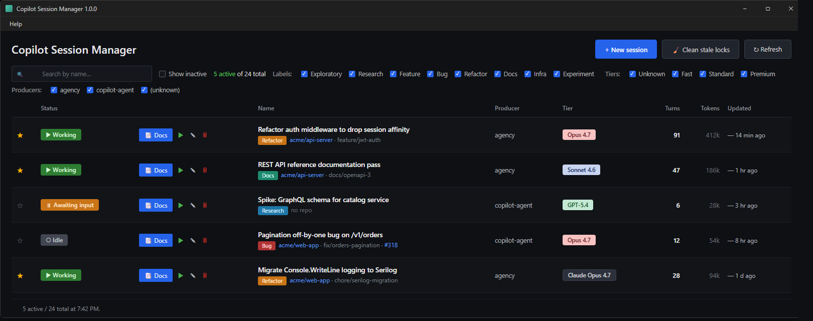

# Copilot Session Manager

> A native Windows desktop application for managing your GitHub Copilot CLI sessions — track tokens, organize work, document automatically, and never lose context again.

[](https://github.com/richardpan/copilot-session-manager)
[](https://dotnet.microsoft.com/)
[](https://github.com/richardpan/copilot-session-manager/releases/tag/v1.4.0)
[]()
[](LICENSE)

---



> *The dashboard at a glance — search, filter by label · tier · producer, color-coded status pills, per-session **Docs / Open / Rename / Delete** actions, and live token / turn counts. **Mockup with synthetic example data**; the source HTML is at [`docs/images/dashboard-mockup.html`](docs/images/dashboard-mockup.html).*

---

## Table of Contents

- [Overview](#overview)
- [Why This Exists](#why-this-exists)
- [Quick Install](#quick-install)
- [Key Features](#key-features)
  - [Dashboard](#dashboard)
  - [Session Lifecycle](#session-lifecycle)
  - [Filtering and Discovery](#filtering-and-discovery)
  - [Generated Session Docs](#generated-session-docs)
  - [Reliability and Quality of Life](#reliability-and-quality-of-life)
  - [Roadmap](#roadmap)
- [How It Works](#how-it-works)
  - [Architecture](#architecture)
  - [Reading Copilot CLI Storage](#reading-copilot-cli-storage)
  - [PowerShell Integration](#powershell-integration)
  - [Generated Session Docs Flow](#generated-session-docs-flow)
- [Tech Stack](#tech-stack)
- [Build from Source](#build-from-source)
- [Configuration](#configuration)
- [Project Structure](#project-structure)
- [Roadmap & Issues](#roadmap--issues)
- [Contributing](#contributing)
- [License](#license)

---

## Overview

**Copilot Session Manager** is a Windows desktop application that gives you a single pane of glass over every GitHub Copilot CLI session running on your machine. Instead of juggling terminal windows, losing track of which session is doing what, and burning through token budgets unnoticed, you get an organized dashboard with live status, cost awareness, automatic documentation, and one-click access to any session's terminal.

Think of it as a **task manager built specifically for AI coding assistants**.

---

## Why This Exists

Modern engineering work with Copilot CLI tends to spawn many parallel sessions:

- One session refactoring auth
- Another building UI components
- A third investigating a production bug
- A fourth writing documentation

Within an hour you have **5+ terminal windows open**, each with hundreds of thousands of tokens of context, and zero way to:

- Tell at a glance which sessions are *actively working* vs *waiting on you* vs *idle*
- See how much budget each session has consumed
- Find the right window when you need to jump back into a specific piece of work
- Remember what each session was actually doing two days later
- Move useful context from one session into a related one without copy-pasting transcripts

Copilot Session Manager solves all of these problems with a native Windows app that hosts and orchestrates the sessions for you.

---

## Quick Install

**Windows 10 (1809+) or Windows 11, x64.**

1. Download `copilot-session-manager-v1.4.0-win-x64.zip` from the
   [v1.4.0 release page](https://github.com/richardpan/copilot-session-manager/releases/tag/v1.4.0).
2. Right-click the zip → **Properties** → tick **Unblock** → **OK**
   (Windows quarantine flag for downloaded executables).
3. Extract anywhere (e.g. `%LOCALAPPDATA%\Programs\copilot-session-manager\`).
4. Run `CopilotSessionManager.exe`.

The release zip is **self-contained** — no .NET runtime install required
(~74 MB compressed, ~148 MB extracted).

**For full functionality you'll also want:**

- [GitHub Copilot CLI](https://docs.github.com/en/copilot/github-copilot-in-the-cli) ≥ `1.0.43` on PATH (the dashboard reads from `~/.copilot/`).
- [GitHub CLI (`gh`)](https://cli.github.com/) authenticated, for PR/issue
  badges and merge features (`gh auth login`). The app degrades gracefully
  when `gh` is missing or offline.
- PowerShell 7+ (`pwsh`) recommended — `▶ Open` will use it if present
  and fall back to Windows PowerShell 5.1.

The first time you launch, an onboarding screen checks each prerequisite
and walks you through anything missing.

---

## Key Features

V1.4.0 ships the dashboard, the full session lifecycle, and the
embedded ConPTY terminal with tabbed multi-session view. Everything
listed below works in the released build.

### Dashboard

- **Sortable data-table view** of every session in `~/.copilot/session-state/`
  with status pills, model tier, turn count, **token consumption**, and
  last-updated timestamp.
- **Color-coded status** — `Working` (green) · `Awaiting input` (amber) ·
  `Idle` (gray) · `Crashed` (red) · `Inactive` (dim) — see at a glance
  which session needs your attention.
- **Token columns** show what each session has consumed so far.
- **Status bar** with live counts (active / total) and a clock-stamped
  refresh time.

### Session Lifecycle

- **▶ Open** — launches a new PowerShell tab and `--resume`s the session,
  or brings the existing terminal back to focus if it's already running.
- **+ New session** — starts a fresh `copilot` in your home directory; the
  new card appears within seconds.
- **✎ Rename** — give a session a memorable name. The original Copilot
  summary stays available in the tooltip.
- **🗑 Delete** — removes the session folder from disk with a confirmation
  step; CSM-side overrides (rename, star, README cache) are cleaned up too.
- **🧹 Clean stale locks** — sweeps lingering `inuse.<pid>.lock` files left
  by crashed CLI processes. Live locks are never touched. There is also an
  opt-in **auto-clean on startup** setting.
- **Crashed-session detection** — the dashboard recognizes orphaned
  sessions whose CLI process has exited and surfaces them with a friendly
  status pill.

### Filtering and Discovery

- **Search bar** — live keyword filter across session names (matches both
  the user-supplied display name and the original Copilot title).
- **★ Star** — pin favorite sessions to the top, persisted across restarts.
- **Producer filter** — toggle visibility of `agency` vs. `copilot-agent`
  (sub-agent) sessions. Useful for hiding the parallel sub-agents that
  Copilot spawns during long runs.
- **Label and tier chips** — multi-select filters for session labels
  (Exploratory, Research, Feature, Bug, Refactor, Docs, Infra, Experiment)
  and model tiers (Unknown, Fast, Standard, Premium).
- **Show inactive** toggle — hide sessions that have not been touched
  recently.

### Generated Session Docs

Two distinct files per session:

- **`SESSION-README.md`** — the existing, agent-curated summary that
  Copilot writes itself. csm reads it (to surface PR/issue links) but
  **never overwrites it** — if you've configured your agent to maintain
  this file, csm leaves it alone.
- **`SESSION-DOCS.md`** + **`SESSION-DOCS.html`** — *brand new in V1.6*,
  csm-owned. Click **📑 Docs** on any row and csm scaffolds an empty
  `SESSION-DOCS.md` template (Overview · Decisions · Features · Mockups · …)
  in the session folder, then generates a self-contained HTML view that
  bundles your hand-curated notes with auto-derived indexes of files,
  plan, and checkpoints. The HTML opens in your default browser. csm
  never overwrites your edits to `SESSION-DOCS.md`.

### Reliability and Quality of Life

- **First-run onboarding** that checks Copilot CLI version + `gh` auth.
- **Comprehensive button tooltips** — every action explains what it does,
  when you'd want it, and any side effects (e.g. *"Removes stale
  `inuse.<pid>.lock` files left by crashed CLI processes. Live locks are
  never touched."*).
- **System tray** — minimize-to-tray with single-instance enforcement
  via a named Mutex.
- **GitHub integration** — per-session PR badge with inline CI status,
  manual issue linking by `#NN`, branch / commit metadata. Degrades
  gracefully when offline or unauthenticated.
- **DPAPI-encrypted** local SQLite database for cached metadata.
- **Settings schema versioning** with forward-compatible migrations.
- **Structured logging** via Serilog to `%LOCALAPPDATA%\CopilotSessionManager\logs\`.
- **905 automated tests** — Core, app, and Native — gating every commit.

### Roadmap

V1.x backlog tracked as
[GitHub issues](https://github.com/richardpan/copilot-session-manager/issues)
includes:

- ⌨️ Global keyboard shortcuts & `Ctrl+K` command palette
- 💵 Per-session cost estimates and trend charts
- 💰 Token budget alerts with auto-checkpoint and seamless restart
- 🎯 Partial context merge — pick which files / turns / artifacts to copy
  between sessions
- 🔍 Side-by-side session diff viewer
- 🤝 Auto-suggested related sessions based on shared signals
- 💤 Auto-archive idle sessions with smart restoration
- 📦 Bulk actions and export bundles (zip with README + transcript + diffs)
- 🔔 Desktop notifications for long-running tasks and waiting sessions
- 📁 Custom groups, saved filters, repo-based auto-grouping
- 🧰 Settings UI (currently the JSON file is hand-edited)
- 🖥️ Embedded ConPTY terminal ([#93](https://github.com/richardpan/copilot-session-manager/issues/93))
- 📦 MSIX packaging + code-signing ([#48](https://github.com/richardpan/copilot-session-manager/issues/48))

---

## How It Works

### Architecture

The app is a single .NET 8 WPF process that runs as a tray-resident
desktop application on Windows.

```
┌─────────────────────────────────────────────────────────────────┐
│                  Copilot Session Manager                        │
│                       (WPF / .NET 8)                            │
│                                                                 │
│  ┌──────────────────────────────────────────────────────────┐   │
│  │  MainWindow (XAML data-table + filters + tray)           │   │
│  └──────────────────────┬───────────────────────────────────┘   │
│                         │                                       │
│  ┌──────────────────────▼───────────────────────────────────┐   │
│  │  ViewModels (CommunityToolkit.Mvvm source generators)    │   │
│  │  MainWindowViewModel · SessionsViewModel · …             │   │
│  └──────────────────────┬───────────────────────────────────┘   │
│                         │                                       │
│  ┌──────────────────────▼───────────────────────────────────┐   │
│  │  Core service layer (Microsoft.Extensions.DI)            │   │
│  │  • SessionDiscoveryService    • SessionLockCleanup       │   │
│  │  • SessionDocsService         • SessionReadmeService     │   │
│  │  • JsonAppSettingsStore       • CopilotPaths             │   │
│  │  • GitHubClient (via gh CLI)  • SerilogLoggerFactory     │   │
│  └──────────────────────┬───────────────────────────────────┘   │
│                         │                                       │
│  ┌──────────────────────▼───────────────────────────────────┐   │
│  │  Native / platform layer                                 │   │
│  │  • Win32 P/Invoke (single-instance Mutex, tray HWND)     │   │
│  │  • System.Security.Cryptography.ProtectedData (DPAPI)    │   │
│  │  • System.IO.FileSystemWatcher (workspace.yaml watch)    │   │
│  └──────────────────────────────────────────────────────────┘   │
└─────────────────────────────────────────────────────────────────┘
              │                                  │
              ▼                                  ▼
   ┌──────────────────────┐         ┌─────────────────────────────┐
   │  ~/.copilot/         │         │  External pwsh.exe windows  │
   │  session-state/      │         │  (one per "▶ Open" click,   │
   │  workspace.yaml      │         │  reused via HWND tracking)  │
   │  *.lock files        │         └─────────────────────────────┘
   └──────────────────────┘
```

### Reading Copilot CLI Storage

The dashboard does not duplicate Copilot's session metadata. It reads
`~/.copilot/session-store.db`, `workspace.yaml`, `events.jsonl`, and
`inuse.<pid>.lock` files **read-only**, and writes only csm-specific
augmentation (rename / star / GitHub-link overrides, generated
`SESSION-DOCS.html`) under `%LOCALAPPDATA%\CopilotSessionManager\`.

The two stores are joined by the Copilot session id. See
[ADR-0002](docs/adr/0002-read-copilot-cli-storage-directly.md) for the
full decision, the interfaces involved (`ISessionStore`,
`ISessionFolderReader`, `ISessionDiscoveryService`, `ICopilotPaths`),
and the join-key contract.

### PowerShell Integration

V1.4.0 ships an **embedded ConPTY terminal** with a tabbed multi-session
view ([#93](https://github.com/richardpan/copilot-session-manager/issues/93),
[#159](https://github.com/richardpan/copilot-session-manager/issues/159)).
Clicking `▶ Open` on a card opens (or focuses) a tab in the dashboard's
terminal panel rather than spawning an external console. The renderer is
a custom WPF surface backed by a hand-rolled VT parser and a 1000-line
scroll-back screen buffer; mouse selection, Ctrl+C / Ctrl+V, Alt+drag
block selection, right-click Copy / Paste, double-/triple-click word
and row selection, and auto-resize are all wired up.

An **external** PowerShell window remains available via the row context
menu's "Open in external window" and "Detach to external window" entries
for sessions you want to pop out (PowerShell 7+ preferred, falling back
to Windows PowerShell 5.1). The window's `HWND` is tracked via Win32
P/Invoke so subsequent clicks focus the existing window instead of
spawning duplicates.

### Generated Session Docs Flow

1. **Click 📑 Docs** on a session row.
2. **Scaffold** — if `<session-folder>/SESSION-DOCS.md` does not exist,
   csm writes a templated markdown skeleton (Overview · Decisions ·
   Features · Mockups · Open Questions) for you or your agent to fill in.
   csm **never overwrites** an existing `SESSION-DOCS.md`.
3. **Generate** — csm regenerates `SESSION-DOCS.html` if it is missing
   or older than the `.md`. The HTML bundles your hand-curated narrative
   with auto-derived indexes pulled from the session folder: file tree,
   plan.md, checkpoint titles, image gallery for any mockups under
   `files/`, and so on.
4. **Open** — csm shells out to the OS to open the HTML in your default
   browser.

This pattern keeps the agent's existing `SESSION-README.md` workflow
completely untouched while giving csm a place of its own to write
documentation pages.

---

## Tech Stack

| Layer | Choice | Why |
|-------|--------|-----|
| Runtime | **.NET 8** | Long-term support, AOT-capable, fast |
| UI Framework | **WPF** | Most mature Windows UI framework, deep Win32 access, excellent tooling |
| MVVM | **CommunityToolkit.Mvvm** | Source generators reduce boilerplate |
| Hosting | **Microsoft.Extensions.Hosting / DI / Logging** | Standard .NET app composition |
| Markdown | **Markdig** | Fast, extensible Markdown → HTML for `SESSION-DOCS.html` |
| YAML | **YamlDotNet** | Parses Copilot's `workspace.yaml` |
| Persistence | **SQLite via Microsoft.Data.Sqlite** | Local, file-based, zero-config |
| Encryption | **System.Security.Cryptography.ProtectedData** (DPAPI) | Native Windows per-user secret protection for the local DB |
| GitHub | **`gh` CLI** (shelled out) | Reuses the user's existing auth + offline degradation is trivial |
| Logging | **Serilog** + Sinks.File / Debug / Enrichers | Structured logging with rolling files |
| Testing | **xUnit + Moq + FluentAssertions + coverlet** | Standard .NET test stack — 905 tests gating every commit |
| Packaging | **Self-contained `dotnet publish` zip** (V1) → MSIX + code-signing planned for V2 ([#48](https://github.com/richardpan/copilot-session-manager/issues/48)) |

---

## Build from Source

### Prerequisites

- Windows 10 (1809+) or Windows 11
- [.NET 8 SDK](https://dotnet.microsoft.com/download/dotnet/8.0)
- [GitHub CLI (`gh`)](https://cli.github.com/) authenticated
  (`gh auth login`)
- [GitHub Copilot CLI](https://docs.github.com/en/copilot/github-copilot-in-the-cli)
  installed and authenticated
- PowerShell 7+ (`pwsh`) recommended

### Clone, restore, build, run

```powershell
git clone https://github.com/richardpan/copilot-session-manager.git
cd copilot-session-manager
dotnet restore
dotnet build CopilotSessionManager.sln -c Release /warnaserror
dotnet test  CopilotSessionManager.sln -c Release --no-build
dotnet run   --project src\CopilotSessionManager
```

### Reproduce a release artifact

```powershell
dotnet publish src\CopilotSessionManager\CopilotSessionManager.csproj `
  -c Release -r win-x64 --self-contained true `
  -p:IncludeNativeLibrariesForSelfExtract=true `
  -o publish\v1.4.0
Compress-Archive -Path publish\v1.4.0\* `
  -DestinationPath publish\copilot-session-manager-v1.4.0-win-x64.zip
```

---

## Configuration

User settings live at
`%LOCALAPPDATA%\CopilotSessionManager\settings.json` and are managed by
the JSON-backed `IAppSettingsStore`. The schema is intentionally tiny in
V1 (a settings UI is on the V1.x roadmap):

```json
{
  "schemaVersion": 1,
  "onboardingCompleted": true,
  "logLevel": "Information",
  "minimizeToTrayOnClose": true,
  "autoCleanStaleLocksOnStartup": false
}
```

| Key | Default | Notes |
|-----|---------|-------|
| `schemaVersion` | `1` | Auto-managed; bumps trigger forward-compatible migrations. |
| `onboardingCompleted` | `false` | Set to `true` after the first-run wizard finishes. |
| `logLevel` | `"Information"` | Serilog minimum level. `Verbose` / `Debug` / `Information` / `Warning` / `Error`. |
| `minimizeToTrayOnClose` | `true` | When `true`, closing the window minimizes to the tray instead of exiting. |
| `autoCleanStaleLocksOnStartup` | `false` | When `true`, csm runs the toolbar 🧹 *Clean stale locks* command once after the initial scan on every launch. |

Logs are written to `%LOCALAPPDATA%\CopilotSessionManager\logs\` and
rotated daily.

---

## Project Structure

```
copilot-session-manager/
├── src/
│   ├── CopilotSessionManager/              # WPF app (entry point)
│   │   ├── Views/                           # MainWindow + dialogs
│   │   ├── ViewModels/                      # MainWindowViewModel, SessionsViewModel, …
│   │   ├── Controls/                        # Custom WPF controls
│   │   ├── Logging/                         # Serilog setup
│   │   ├── App.xaml(.cs)                    # Application entry + DI composition
│   │   └── CopilotSessionManager.csproj
│   ├── CopilotSessionManager.Core/         # Business logic (no UI, multi-target safe)
│   │   ├── Configuration/                   # AppMetadata, AppPaths
│   │   ├── DependencyInjection/             # ServiceCollection extensions
│   │   ├── Sessions/                        # Discovery, lock cleanup, docs, README
│   │   ├── Settings/                        # AppSettings + JsonAppSettingsStore
│   │   ├── GitHub/                          # gh CLI shell-out + offline detection
│   │   └── Logging/                         # ZipLogBundler
│   └── CopilotSessionManager.Native/       # Win32 P/Invoke wrappers
├── tests/
│   ├── CopilotSessionManager.Core.Tests/   # 566 tests
│   ├── CopilotSessionManager.Tests/        # 337 tests (WPF VM + integration)
│   └── CopilotSessionManager.Native.Tests/ # 2 tests
├── docs/
│   ├── adr/                                 # Architecture Decision Records
│   ├── images/
│   │   ├── dashboard.png                    # README hero (synthetic mockup)
│   │   └── dashboard-mockup.html            # source HTML for the mockup
│   ├── a11y-manual-test.md                  # Narrator + Accessibility Insights checklist
│   └── manual-tests.md                      # Manual smoke tests
├── mockup/
│   └── copilot-session-manager.html         # Original V0 interactive UI mockup
├── .github/
│   ├── workflows/                           # CI / format / test pipeline
│   └── ISSUE_TEMPLATE/
├── Directory.Build.props                    # Repo-wide version + analyzer settings
├── CopilotSessionManager.sln
└── README.md
```

---

## Roadmap & Issues

- 🎯 **Latest release:** [v1.4.0](https://github.com/richardpan/copilot-session-manager/releases/tag/v1.4.0)
- 📋 **All issues:** [github.com/richardpan/copilot-session-manager/issues](https://github.com/richardpan/copilot-session-manager/issues)
- 🏷️ **Labels:** `v1` · `v2` · `enhancement` · `ux` · `cost-tracking` · `collaboration` · `lifecycle` · `documentation`

---

## Contributing

Contributions are welcome! Please:

1. Open an issue first to discuss any non-trivial change.
2. Fork the repo and create a topic branch.
3. Follow the existing code style (`.editorconfig` enforced;
   `dotnet format --verify-no-changes` runs in CI).
4. Add tests for new logic — Core target has a coverage floor.
5. Make sure the trifecta is clean before opening a PR:
   ```powershell
   dotnet build CopilotSessionManager.sln -c Release /warnaserror
   dotnet test  CopilotSessionManager.sln -c Release --no-build
   dotnet format CopilotSessionManager.sln --verify-no-changes
   ```
6. Open a pull request referencing the issue.

---

## License

MIT — see [`LICENSE`](LICENSE) for details.

---

<p align="center">
  <em>Built with ❤️ for engineers who run too many Copilot sessions at once.</em>
</p>
